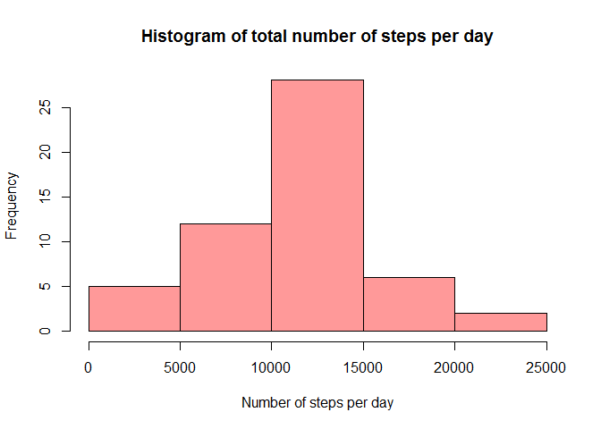
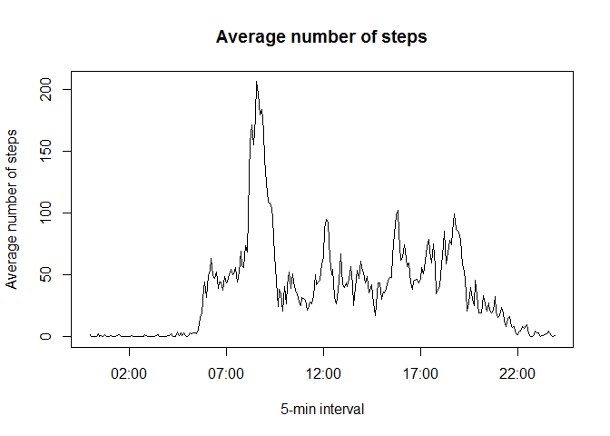
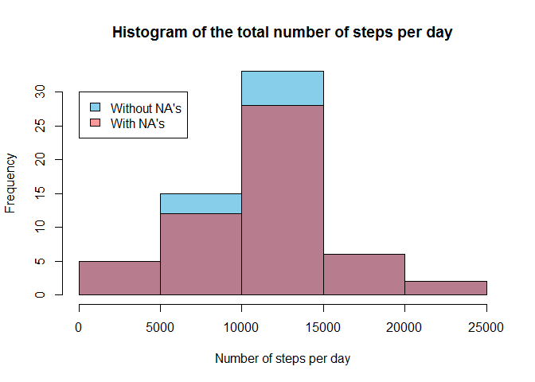
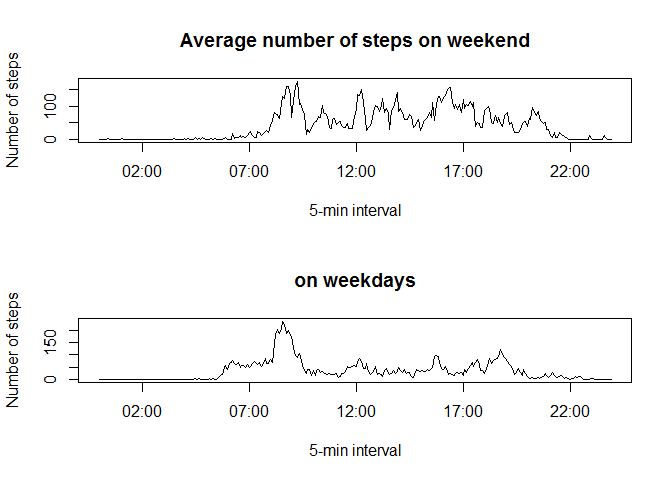

# Reproducible Research - Assessment 1

### Loading and preprocessing the data
The data of the assessment is part of the git repository. First we unpack the
zip-file in the local and extract the csv-file.

```r
dataFile <- "activity.csv"
if (!file.exists(dataFile)) {
    unzip("activity.zip")
}
```

Now we can import the data and convert missing values to NA and dates to date objects.

```r
data <- read.table(dataFile, header = TRUE, sep = ",", na.strings = "NA")
data <- transform(data, date = as.Date(date))
```

For convenience with prepare a function to convert the intervals in timestamps
that are nicely plots on the x-axis.

```r
intervalToTime <- function(val) {
    str <- sprintf("%04d",val)
    time <- paste(substr(str,1,2),substr(str,3,4),sep = ":")
    strptime(paste("2015-01-01", time), "%Y-%m-%d %H:%M")
}
```

The dataset contains 17568 observations of the following variables.  
* *steps*: Number of steps taking in a 5-minute interval (incl. missing values)  
* *date*: The date on which the measurement was taken  
* *interval*: Identifier for the 5-minute interval in which the measurement was taken  

### What is mean total number of steps taken per day?

For the first part of the analysis we ignore missing values. Here's a histogram of the total number of each day.

```r
dataNoNa <- subset(data, complete.cases(data))
stepsPerDay <- aggregate(steps ~ date, dataNoNa, sum)
hist(stepsPerDay$steps, main="Histogram of total number of steps per day",
     xlab="Number of steps per day", col=scales::alpha("red",0.4))
```

 

The mean and median total number of steps taken per day are very close together.

```r
summary(stepsPerDay$steps)[3:4]
```

```
## Median   Mean 
##  10760  10770
```

### What is the average daily activity pattern?
The following plot shows the average number of steps that are taken in every 5-min interval of the day.

```r
stepsPerInterval <- aggregate(steps ~ interval, dataNoNa, mean)
stepsPerInterval <- transform(stepsPerInterval, time = intervalToTime(interval))
with(stepsPerInterval,
     plot(time, steps, type="l", main="Average number of steps",
          xlab="5-min interval", ylab="Average number of steps"))
```

 

In average most steps are taken in the morning at 8:35.

```r
stepsPerInterval[order(stepsPerInterval$steps, decreasing = TRUE)[1],]
```

```
##     interval    steps                time
## 104      835 206.1698 2015-01-01 08:35:00
```

### Imputing missing values
The dataset contains several missing values. The presence of missing days may introduce a bias into the calculations or summaries of the data. To deduce a reasonable
strategy to fill up the missing values we start with some analysis to understand
how the missing values are distributed. In a second step we implement the strategy
and analyse the impact of imputing missing values.

In total the dataset contains 2304 missing values in the dataset.

```r
summary(data)[7]
```

```
## [1] "NA's   :2304  "
```

Next we look at the distribution of the missing values. Each day has
24*60min/5min = 288 intervals of 5 minutes. First we assert that the dataset
does not have any missing intervals on some days.

```r
all(as.integer(table(data$date))==288)
```

```
## [1] TRUE
```

Now, let's answer the question how many days have missing values. The complete dataset contains 61 days, and 8 days have missing values. If a day has missing values, then all intervals of this day are missing.

```r
dataNa <- data[is.na(data$steps),]
dataNaTable <- table(dataNa$date)
length(dataNaTable)
```

```
## [1] 8
```

```r
all(as.integer(dataNaTable)==288)
```

```
## [1] TRUE
```

This makes it rather easy to implement a reasonalbe imputing strategy. We can fill up each interval with the mean of the same weekday and the same 5-minute interval.

First we create a table with the mean of each weekday and each interval. Then we replace all missing values in the original data with the corresponding means.

```r
dataWithDays <- transform(dataNoNa, day = weekdays(date))
meanSteps <- aggregate(steps ~ day + interval, dataWithDays, mean)
dataNaWithDays <- transform(dataNa, day = weekdays(date), steps = NULL)
dataNaFilled <- subset(merge(dataNaWithDays, meanSteps), select=-day)
dataFilled <- rbind(dataNoNa, dataNaFilled)
```

Now we can compare the histogram of the total number of steps per day with the previous results that contained missing values.

```r
stepsPerDayFilled <- aggregate(steps ~ date, dataFilled, sum)
hist(stepsPerDayFilled$steps, col="skyblue",
     main="Histogram of the total number of steps per day",
     xlab="Number of steps per day")
hist(stepsPerDay$steps, col=scales::alpha("red",0.4), add = TRUE)
legend(30, c("Without NA's", "With NA's"), fill=c("skyblue", scales::alpha("red",0.4)))
```

 

The main difference of the two histograms is in the center of the distribution around the mean value. Imputing missing values increases the mean and median of the total number of steps slightly.

```r
rbind("withMissingValues"=summary(stepsPerDay$steps)[3:4],
      "withoutMissingValues"=summary(stepsPerDayFilled$steps)[3:4])
```

```
##                      Median  Mean
## withMissingValues     10760 10770
## withoutMissingValues  11020 10820
```

We can conclude that the impact of imputing missing data is a small increase of the total daily number of steps. However the impact is not dramatic. This in agreement with the fact that we replaced the 7.625% of missing data with average values.

### Are there differences in activity patterns between weekdays and weekends?
In the last section we analyse the difference between weekdays and weekends in the dataset with imputed values.

```r
Sys.setlocale("LC_TIME", "English")
```

```
## [1] "English_United States.1252"
```

```r
isWeekend <- function(date) { weekdays(date) %in% c("Saturday", "Sunday")}
dataWeekdays <- transform(dataFilled,
                          day=factor(isWeekend(date),levels=c(T,F),
                                     labels=c("weekend","weekday")))
```

Finally we make a time series plot of the 5-minute interval and the average number of steps taken, averaged across all weekday days or weekend days (y-axis). On weekdays, the activity pattern is considerably different from the weekends, where people do not have to walk to work.

```r
stepsWeekend <- aggregate(steps ~ interval+day, dataWeekdays, mean)
stepsWeekend <- transform(stepsWeekend, time = intervalToTime(interval))
par("mfrow"=c(2,1))
with(stepsWeekend[stepsWeekend$day=="weekend",],
     plot(time, steps, type="l", main="Average number of steps on weekend",
          xlab="5-min interval", ylab="Number of steps"))
with(stepsWeekend[stepsWeekend$day!="weekend",],
     plot(time, steps, type="l", main="on weekdays",
          xlab="5-min interval", ylab="Number of steps"))
```

 
